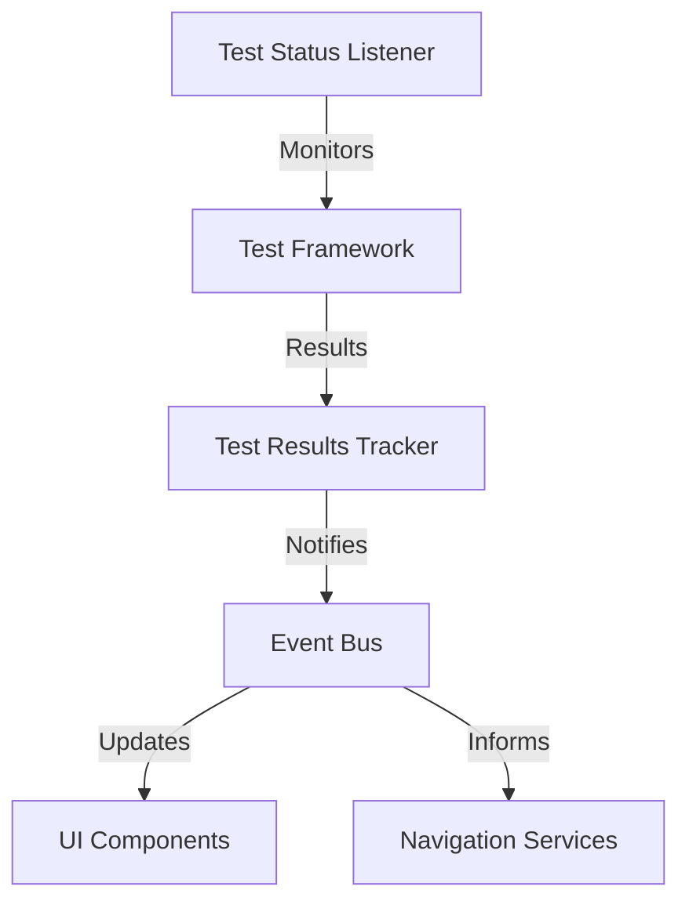
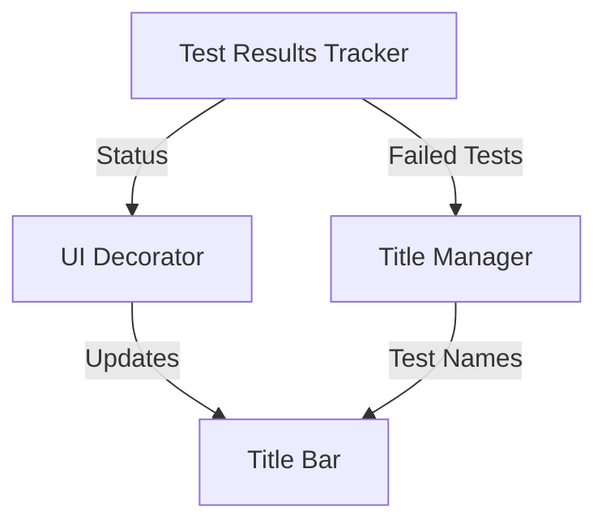
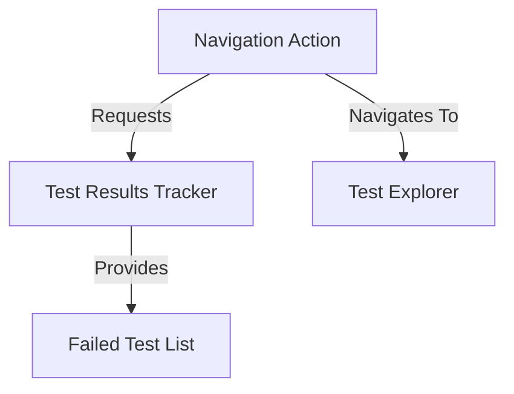
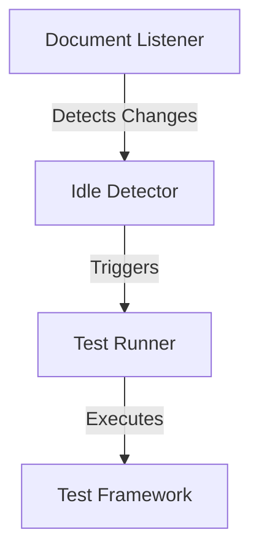

# TddHelper Rider Plugin Architecture

## Overview

TddHelper is a JetBrains Rider plugin designed to enhance Test-Driven Development workflows. The plugin provides visual feedback on test status, navigation to failed tests, and automatic test execution.

## Core Architecture Principles

1. **Interface-Based Design**
   - All key components defined by interfaces
   - Implementation classes separate from interfaces
   - Allows for future extension and replacement

2. **Service-Oriented Architecture**
   - Core functionality implemented as services
   - Services registered with the IntelliJ Platform
   - Clear separation of concerns

3. **Event-Based Communication**
   - Components communicate through events
   - Loose coupling between components
   - Extensible notification system

## Key Components

### 1. Test Status Tracking



**Components:**
- `TestStatusListener`: Subscribes to Rider's test execution events
- `TestResultsTracker`: Stores and manages test results
- Event system for notifying other components

### 2. UI Decoration



**Components:**
- `UIDecorator`: Handles visual indicators (red border)
- `TitleManager`: Manages test names in title bar

### 3. Test Navigation



**Components:**
- `NavigationAction`: Action for keyboard shortcut
- Integration with Rider's test explorer

### 4. Auto-Test Runner (Future)



**Components:**
- `DocumentListener`: Monitors code changes
- `IdleDetector`: Detects when typing has stopped
- `TestRunner`: Triggers test execution

## Extension Points

The architecture is designed with these extension points:

1. **Test Detection Strategies**
   - Interface: `TestDetectionStrategy`
   - Default: `IdleTimeDetectionStrategy`

2. **UI Notification Methods**
   - Interface: `UINotificationService`
   - Defaults: `TitleBarDecorator`, `TestNameDisplayService`

3. **Test Result Processors**
   - Interface: `TestResultProcessor`
   - Default: `DefaultTestResultProcessor`

4. **Navigation Strategies**
   - Interface: `NavigationStrategy`
   - Default: `TestExplorerNavigationStrategy`

## Service Registration

Services are registered with the IntelliJ Platform:

```kotlin
// In plugin.xml
<extensions defaultExtensionNs="com.intellij">
    <applicationService serviceImplementation="com.yourname.tddhelper.services.TestResultsTracker"/>
    <!-- Other services -->
</extensions>
```

## Communication Flow

1. Test execution completes in Rider
2. `TestStatusListener` captures the results
3. `TestResultsTracker` updates its state
4. UI components are notified and updated
5. Navigation services are informed of new failed tests

This architecture provides a solid foundation for the initial features while allowing for future expansion and customization.
