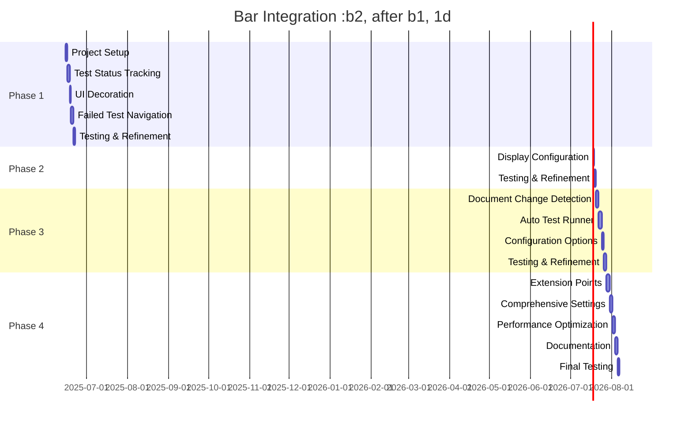

# TddHelper Development Roadmap

This document outlines the development roadmap for the TddHelper Rider plugin, breaking down the implementation into manageable phases with clear milestones and deliverables.

## Phase 1: Core Framework and Initial Features

**Objective:** Implement the foundation and core features of the plugin.

### Milestones

1. **Project Setup**
   - Create basic plugin structure
   - Configure Gradle build
   - Set up plugin.xml with dependencies
   - Create initial service registration

2. **Test Status Tracking**
   - Implement TestStatusListener
   - Implement TestResultsTracker service
   - Create event system for status changes
   - Test with various testing frameworks

3. **UI Decoration**
   - Implement UIDecorator service
   - Add red border for failed tests
   - Ensure proper cleanup on plugin unload
   - Test with different Rider themes

4. **Failed Test Navigation**
   - Implement GotoNextFailedTestAction
   - Register action with keyboard shortcut
   - Add action to Tools menu
   - Test navigation functionality

### Deliverables

- Functional plugin with red title bar for failed tests
- Navigation action to cycle through failed tests
- Basic plugin documentation
- Initial unit tests

### Timeline

- Project Setup: 1 day
- Test Status Tracking: 2 days
- UI Decoration: 1 day
- Failed Test Navigation: 2 days
- Testing and Refinement: 1 day

**Total: 7 days**

## Phase 2: Enhanced Visualization

**Objective:** Improve visual feedback by displaying failed test names in the title bar.

### Milestones

1. **Title Manager Implementation**
   - Create TitleManager service
   - Implement test name extraction
   - Add formatting logic for multiple tests
   - Test with various test name formats

2. **Title Bar Integration**
   - Update window title with test names
   - Handle multiple project windows
   - Ensure proper title restoration
   - Test with different project configurations

3. **Display Configuration**
   - Add basic settings for display options
   - Implement configurable test name limit
   - Add truncation options
   - Test with various configurations

### Deliverables

- Title bar showing failed test names
- Configurable display options
- Updated documentation
- Additional unit tests

### Timeline

- Title Manager Implementation: 2 days
- Title Bar Integration: 1 day
- Display Configuration: 1 day
- Testing and Refinement: 1 day

**Total: 5 days**

## Phase 3: Auto-Test Runner

**Objective:** Implement automatic test execution when typing stops.

### Milestones

1. **Document Change Detection**
   - Implement DocumentChangeListener
   - Add idle time detection
   - Create registration mechanism for editors
   - Test with various editing scenarios

2. **Auto Test Runner**
   - Implement AutoTestRunner service
   - Add test execution triggering
   - Create smart test selection logic
   - Test with different project types

3. **Configuration Options**
   - Add settings for idle time threshold
   - Implement enable/disable toggle
   - Add test scope configuration
   - Test with various configurations

### Deliverables

- Automatic test execution on idle
- Configurable idle time detection
- Updated documentation
- Additional unit tests

### Timeline

- Document Change Detection: 2 days
- Auto Test Runner: 3 days
- Configuration Options: 1 day
- Testing and Refinement: 2 days

**Total: 8 days**

## Phase 4: Extensibility and Polish

**Objective:** Formalize extension points and polish the plugin for release.

### Milestones

1. **Extension Point Formalization**
   - Define formal extension interfaces
   - Implement extension registration
   - Create example extensions
   - Test extension mechanisms

2. **Comprehensive Settings**
   - Create settings UI
   - Implement persistent configuration
   - Add default profiles
   - Test settings persistence

3. **Performance Optimization**
   - Profile plugin performance
   - Optimize event handling
   - Reduce UI thread operations
   - Test with large projects

4. **Documentation and Examples**
   - Create comprehensive documentation
   - Add example extensions
   - Create usage guides
   - Prepare for publication

### Deliverables

- Formalized extension points
- Comprehensive settings UI
- Optimized performance
- Complete documentation
- Ready for publication

### Timeline

- Extension Point Formalization: 3 days
- Comprehensive Settings: 2 days
- Performance Optimization: 2 days
- Documentation and Examples: 2 days
- Final Testing and Refinement: 1 day

**Total: 10 days**

## Overall Timeline

## Development Priorities

1. **Correctness:** Ensure the plugin works correctly in all scenarios
2. **Performance:** Minimize impact on IDE performance
3. **User Experience:** Create intuitive, non-intrusive features
4. **Extensibility:** Design for future expansion
5. **Compatibility:** Ensure compatibility with different Rider versions

## Testing Strategy

### Continuous Testing

- Unit tests for all components
- Integration tests for component interaction
- UI tests for visual elements
- Performance tests for critical operations

### Manual Testing Scenarios

1. **Basic Functionality**
   - Run tests that pass
   - Run tests that fail
   - Verify title bar changes
   - Navigate through failed tests

2. **Edge Cases**
   - Very large test suites
   - Tests with long names
   - Multiple project windows
   - Plugin disable/enable

3. **Integration Testing**
   - Different testing frameworks
   - Different project types
   - Different Rider versions
   - Different operating systems

## Risk Management

### Potential Risks

1. **API Changes:** JetBrains Platform API may change
   - Mitigation: Use stable APIs where possible
   - Contingency: Monitor EAP releases for changes

2. **Performance Impact:** Document listening may affect performance
   - Mitigation: Optimize event handling
   - Contingency: Make feature optional

3. **UI Inconsistencies:** Different themes/OS may affect UI
   - Mitigation: Test on multiple platforms
   - Contingency: Provide fallback UI options

4. **Test Framework Compatibility:** Different test frameworks may behave differently
   - Mitigation: Test with multiple frameworks
   - Contingency: Add framework-specific adapters

## Success Criteria

The plugin will be considered successful when:

1. It correctly identifies and displays test failures
2. Navigation to failed tests works reliably
3. Automatic test execution works without disrupting workflow
4. Performance impact is minimal
5. User feedback is positive

This roadmap provides a structured approach to developing the TddHelper plugin, with clear phases, milestones, and deliverables.
