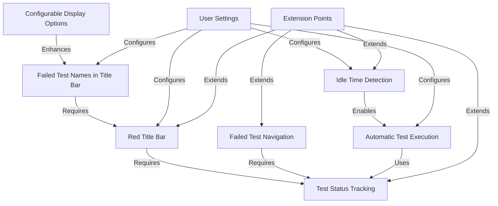

# TddHelper Rider Plugin Features

## Feature Overview

TddHelper enhances Test-Driven Development workflows in Rider with visual feedback, navigation tools, and automated test execution. This document outlines all planned features with implementation priorities.

## Implementation Phases

### Phase 1: Core Features (Initial Implementation)

These features form the foundation of the plugin and will be implemented first:

1. **Red Title Bar for Failed Tests**
   - Visual indicator when tests fail
   - Clear border around the IDE window
   - Immediate feedback on test status

2. **Failed Test Navigation**
   - Keyboard shortcut to navigate to failed tests
   - Cycle through all failed tests
   - Integration with Rider's test explorer

### Phase 2: Enhanced Visualization

These features enhance the visual feedback:

1. **Failed Test Names in Title Bar**
   - Display names of failed tests in the title bar
   - Show count of additional failures if many tests fail
   - Clear, concise presentation

2. **Configurable Display Options**
   - Control how many test names to show
   - Configure truncation behavior
   - Customize appearance

### Phase 3: Auto-Test Runner

These features automate the test execution process:

1. **Idle Time Detection**
   - Monitor document changes
   - Detect when typing has stopped
   - Configurable idle threshold

2. **Automatic Test Execution**
   - Run tests automatically after idle period
   - Smart test selection (run affected tests)
   - Background execution

### Phase 4: Extensibility & Polish

These features complete the plugin and ensure extensibility:

1. **User Settings**
   - Comprehensive settings UI
   - Persistent configuration
   - Default profiles

2. **Extension Points**
   - Formalized extension mechanisms
   - Documentation for extension
   - Example extensions

## Detailed Feature Specifications

### 1. Red Title Bar for Failed Tests

**Purpose:**
Provide immediate visual feedback when tests fail, making it impossible to miss test failures.

**Implementation:**
- Subscribe to Rider's test execution events
- Track test status (pass/fail)
- Modify the IDE window border using Swing/JFrame decoration
- Red border for failures, normal border for passing tests

**User Experience:**
- No configuration required
- Works with all testing frameworks supported by Rider
- Clear, unmistakable indicator visible in peripheral vision

### 2. Failed Test Navigation

**Purpose:**
Quickly navigate to failed tests without manually searching through the test explorer.

**Implementation:**
- Register an action that can be assigned to a keyboard shortcut
- Track failed tests from the most recent test run
- Navigate to the next failed test in the test explorer
- Cycle through all failed tests when invoked multiple times

**User Experience:**
- Assignable keyboard shortcut (e.g., Alt+F12)
- Works with the test explorer tool window
- Automatically opens test explorer if closed
- Scrolls to and selects the failed test

### 3. Failed Test Names in Title Bar

**Purpose:**
Show which tests are failing without switching focus to the test explorer.

**Implementation:**
- Extract names of failed tests from test results
- Format names according to user preferences
- Update the title bar text while preserving project name
- Handle multiple failures with truncation and counts

**User Experience:**
- See failed test names at a glance
- Understand which tests are failing without context switching
- Clear indication of how many tests are failing

### 4. Configurable Display Options

**Purpose:**
Allow customization of how test information is displayed.

**Implementation:**
- Settings page for display options
- Options for number of test names to show
- Configuration for truncation behavior
- Toggle for showing/hiding different elements

**User Experience:**
- Personalized display based on preferences
- Control information density
- Adapt to different workflows

### 5. Idle Time Detection

**Purpose:**
Detect when the developer has paused typing to trigger automatic test runs.

**Implementation:**
- Document listener to detect changes
- Timer to track idle periods
- Configurable threshold for idle detection
- Smart detection to avoid false triggers

**User Experience:**
- Non-intrusive background monitoring
- No performance impact on typing
- Configurable to match personal workflow

### 6. Automatic Test Execution

**Purpose:**
Run tests automatically when the developer pauses typing.

**Implementation:**
- Trigger test execution after idle period
- Smart selection of which tests to run
- Background execution to avoid disrupting workflow
- Cancel execution if typing resumes

**User Experience:**
- Tests run automatically at natural break points
- Immediate feedback without manual test execution
- Seamless integration into TDD workflow

### 7. User Settings

**Purpose:**
Allow customization of all plugin behavior.

**Implementation:**
- Comprehensive settings page
- Persistent configuration storage
- Default profiles for different workflows
- Real-time preview of settings

**User Experience:**
- Fine-grained control over plugin behavior
- Save and load different configurations
- Intuitive settings organization

### 8. Extension Points

**Purpose:**
Allow for future expansion and customization by users.

**Implementation:**
- Formalized extension point interfaces
- Registration mechanism for extensions
- Documentation and examples
- Version-stable API

**User Experience:**
- Ability to extend functionality
- Integration with other plugins
- Customization for specific workflows

## Feature Dependencies

This feature set provides a comprehensive TDD assistance tool that enhances productivity while remaining unobtrusive and customizable.
